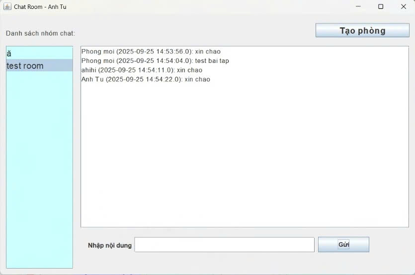
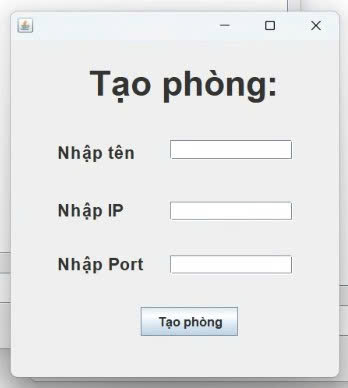

# LTM-1604 Gửi tin nhắn Broadcast qua UDP
<h2 align="center">
    <a href="https://dainam.edu.vn/vi/khoa-cong-nghe-thong-tin">
        🎓 Faculty of Information Technology (DaiNam University)
    </a>
</h2>

<h2 align="center">
    Ứng dụng Gửi Tin Nhắn broadcast Qua UDP
</h2>

<div align="center">
    <p align="center">
        
        
        
    </p>

[](https://www.facebook.com/DNUAIoTLab)
[](https://dainam.edu.vn/vi/khoa-cong-nghe-thong-tin)
[](https://dainam.edu.vn)

</div>

## 1. Giới thiệu hệ thống

 **Ứng dụng Nhắn Tin** được phát triển theo mô hình **Client–Server**, hỗ trợ nhiều người dùng trò chuyện thời gian thực qua trình duyệt web. Ứng dụng được thiết kế với giao diện đơn giản, dễ sử dụng, mang lại trải nghiệm tương tác mượt mà, linh hoạt và phù hợp với nhiều đối tượng người dùng.

🔍 Các Tính Năng Nổi Bật

•	**Nhắn tin thời gian thực**: Sử dụng WebSocket (Socket.IO) để gửi và nhận tin nhắn tức thì, không cần tải lại trang.

•	**Hỗ trợ nhiều phòng chat**: Người dùng dễ dàng tạo và tham gia các phòng trò chuyện theo nhóm hoặc chủ đề.

•	**Quản lý người dùng online**: Hiển thị danh sách người dùng đang trực tuyến theo thời gian thực.

•	**Giao diện thân thiện**: Thiết kế tối giản, hiện đại, thao tác đơn giản, phù hợp mọi đối tượng.

---

## 🔧 2. Công nghệ & Ngôn ngữ sử dụng

[](https://www.oracle.com/java/technologies/javase-downloads.html)  
[](https://docs.oracle.com/javase/tutorial/networking/datagrams/)   
[](https://www.eclipse.org/)  
[](https://netbeans.apache.org/)  

Chi tiết công nghệ 


•	**Java**: Ngôn ngữ lập trình phổ biến, được dùng để phát triển ứng dụng trên nhiều nền tảng khác nhau.

•	**UDP Multicast**: Giao thức mạng giúp truyền dữ liệu đến nhiều người nhận mà không làm quá tải mạng, dùng trong phát sóng trực tuyến.

•	**Eclipse**: IDE mã nguồn mở, chủ yếu dùng để phát triển ứng dụng Java, hỗ trợ nhiều ngôn ngữ qua plugin.

•	**NetBeans**: IDE mã nguồn mở, dễ sử dụng, hỗ trợ phát triển ứng dụng Java và các ngôn ngữ khác như PHP, C++.


## 🚀 3. Một số hình ảnh

### Giao diện đăng nhập


### Giao diện chat room


### Giao diện tạo room


---

## ⚙️ 4. Các bước cài đặt & chạy

🔧 **Bước 1. Chuẩn bị môi trường**
- Cài đặt **JDK 8 hoặc 11**.  
- IDE khuyến nghị: **Eclipse** hoặc **NetBeans**.  

📦 **Bước 2. Tải project**
- Clone repository từ GitHub:  
  ```bash
  git clone https://github.com/username/udp-multicast-chat.git
  cd udp-multicast-chat


---
## 👨‍💻 5 . Liên hệ (cá nhân)

Contact me:  

📌 **Họ tên:** [Hoàng Anh Tú] – CNTT K16-04  
📌 **Khoa:** Công nghệ thông tin – Trường Đại học Đại Nam  
📌 **Email:** [anhtu271024@gmail.com]  
