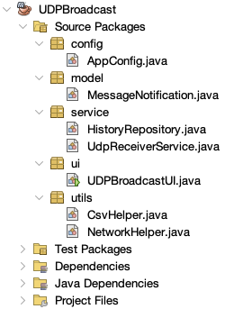
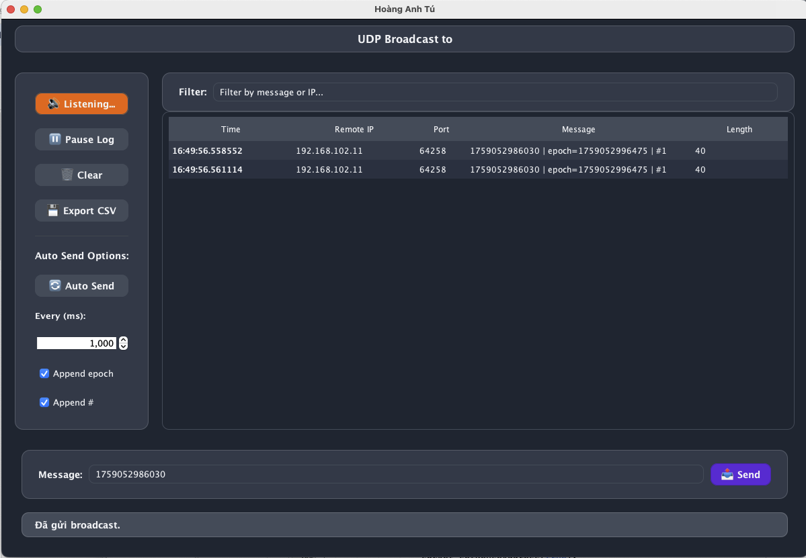

<h2 align="center">
    <a href="https://dainam.edu.vn/vi/khoa-cong-nghe-thong-tin">
        🎓 Faculty of Information Technology (DaiNam University)
    </a>
</h2>

<h2 align="center">
    ỨNG DỤNG GỬI TIN NHẮN BROADCAST QUA UDP
</h2>

<div align="center">
    <p align="center">
        
        
        
    </p>

[](https://www.facebook.com/DNUAIoTLab)
[](https://dainam.edu.vn/vi/khoa-cong-nghe-thong-tin)
[](https://dainam.edu.vn)

</div>

## 1. Giới thiệu hệ thống

 **Ứng dụng Nhắn Tin** được phát triển theo mô hình **Client–Server**, hỗ trợ nhiều người dùng trò chuyện thời gian thực qua trình duyệt web. Ứng dụng được thiết kế với giao diện đơn giản, dễ sử dụng, mang lại trải nghiệm tương tác mượt mà, linh hoạt và phù hợp với nhiều đối tượng người dùng.

🔍 Các Tính Năng Nổi Bật

•	**Nhắn tin thời gian thực**: Sử dụng WebSocket (Socket.IO) để gửi và nhận tin nhắn tức thì, không cần tải lại trang.

•	**Giao diện thân thiện**: Thiết kế tối giản, hiện đại, thao tác đơn giản, phù hợp mọi đối tượng.

---

## 🔧 2. Công nghệ & Ngôn ngữ sử dụng

[](https://www.oracle.com/java/technologies/javase-downloads.html)  
[](https://docs.oracle.com/javase/tutorial/networking/datagrams/)   
[](https://www.eclipse.org/)  
[](https://netbeans.apache.org/)  

Chi tiết công nghệ 


•	**Java**: Ngôn ngữ lập trình phổ biến, được dùng để phát triển ứng dụng trên nhiều nền tảng khác nhau.

•	**Eclipse**: IDE mã nguồn mở, chủ yếu dùng để phát triển ứng dụng Java, hỗ trợ nhiều ngôn ngữ qua plugin.

## 🚀 3. Một số hình ảnh

### Cấu trúc chương trình


### Giao diện chương trình


---


## ⚙️ 4. Các bước cài đặt & chạy

#### 🔧 Bước 1: Chuẩn bị môi trường
- Cài đặt **JDK 21** hoặc **JDK 24**.
- IDE khuyến nghị:  
  - **Eclipse**  
  - **NetBeans**  
  - **IntelliJ IDEA** (tùy chọn)  
- Kiểm tra cài đặt Java:
  ```bash
  java -version
  javac -version
  ```

#### 📦 Bước 2: Tải project
- Clone repository từ GitHub:
  ```bash
  git clone https://github.com/tu-debug-ancut/udp-multicast-chat.git
  cd udp-multicast-chat
  ```

#### ⚡ Bước 3: Import project vào IDE
- Mở IDE → Chọn **Import Project** → **Existing Java Project**.  
- Chỉ định thư mục `udp-multicast` vừa tải về.  
- Kiểm tra cấu trúc source code (`src/main/java`) được IDE nhận đúng.  

#### 🛠 Bước 4: Cấu hình ứng dụng
- Mở file `AppConfig.java`.  
- Điều chỉnh thông số nếu cần:
  - **Địa chỉ Multicast** (ví dụ: `230.0.0.0`)  
  - **Cổng UDP** (ví dụ: `4446`)  
  - **Kích thước gói tin**, **timeout**, v.v.  

#### ▶️ Bước 5: Chạy ứng dụng
- Trong IDE, chạy class `UdpBroadcastView.java` (hoặc `UDPBroadcastUI.java` nếu giữ tên cũ).  
- Mở **nhiều cửa sổ** ứng dụng để mô phỏng nhiều client.  
- Gửi tin nhắn trong một cửa sổ → kiểm tra các cửa sổ khác nhận được tin nhắn qua UDP multicast.  

#### 🚀 Bước 6: Build & chạy file JAR (tùy chọn)
Nếu muốn chạy ứng dụng mà không cần IDE:
```bash
# Biên dịch mã nguồn
javac -d out src/**/*.java

# Tạo file JAR
jar cvfe udp-chat.jar ui.UdpBroadcastUI -C out .
```

Chạy ứng dụng qua file JAR:
```bash
java -jar udp-chat.jar
```

#### ✅ Bước 7: Kiểm tra & gỡ lỗi
- Kiểm tra **Firewall**: cho phép Java sử dụng UDP multicast.  
- Nếu tin nhắn không truyền được:  
  - Kiểm tra địa chỉ IP & cổng.  
  - Thử chạy trên cùng một mạng LAN/WiFi.  
- Có thể thêm **log** trong `NetworkUtils` để debug chi tiết hơn.  

---
## 👨‍💻 5 . Liên hệ (cá nhân)

Contact me:  

📌 **Họ tên:** [Hoàng Anh Tú] – CNTT 16-04  
📌 **Khoa:** Công nghệ thông tin – Trường Đại học Đại Nam  
📌 **Email:** [anhtu271024@gmail.com]  
