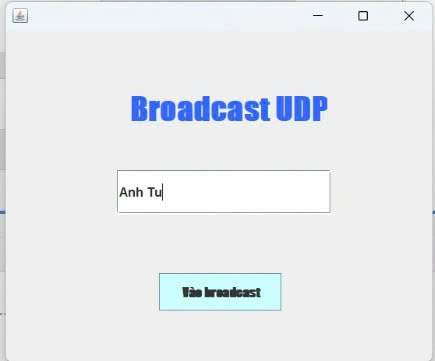

# LTM-1604 Gửi tin nhắn Broadcast qua UDP
<h2 align="center">
    <a href="https://dainam.edu.vn/vi/khoa-cong-nghe-thong-tin">
        🎓 Faculty of Information Technology (DaiNam University)
    </a>
</h2>

<h2 align="center">
    Ứng dụng Gửi Tin Nhắn broadcast Qua UDP
</h2>

<div align="center">
    <p align="center">
        
        
        
    </p>

[](https://www.facebook.com/DNUAIoTLab)
[](https://dainam.edu.vn/vi/khoa-cong-nghe-thong-tin)
[](https://dainam.edu.vn)

</div>

## 1. Giới thiệu hệ thống

**Ứng dụng Nhắn Tin** được xây dựng theo mô hình **Client–Server**, cho phép nhiều người dùng trò chuyện trực tuyến với nhau thông qua giao diện web.  

👉 **Điểm nổi bật**:
- Gửi và nhận tin nhắn theo thời gian thực.  
- Hỗ trợ tạo và tham gia nhiều phòng chat.  
- Hiển thị danh sách người dùng đang online.  
- Giao diện thân thiện, dễ sử dụng, trực quan.  

---

## 🔧 2. Công nghệ & Ngôn ngữ sử dụng

[](https://www.oracle.com/java/technologies/javase-downloads.html)  
[](https://docs.oracle.com/javase/tutorial/networking/datagrams/)   
[](https://www.eclipse.org/)  
[](https://netbeans.apache.org/)  


---

## 🚀 3. Một số hình ảnh

### Giao diện đăng nhập


### Giao diện chat room


### Giao diện tạo room


---

## ⚙️ 4. Các bước cài đặt & chạy

🔧 **Bước 1. Chuẩn bị môi trường**
- Cài đặt **JDK 8 hoặc 11**.  
- IDE khuyến nghị: **Eclipse** hoặc **NetBeans**.  

📦 **Bước 2. Tải project**
- Clone repository từ GitHub:  
  ```bash
  git clone https://github.com/username/udp-multicast-chat.git
  cd udp-multicast-chat


---
## 👨‍💻 6. Liên hệ (cá nhân)

Contact me:  

📌 **Họ tên:** [Hoàng Anh Tú] – CNTT K16-04  
📌 **Khoa:** Công nghệ thông tin – Trường Đại học Đại Nam  
📌 **Email:** [anhtu271024@gmail.com]  
